# E-Commerce Microservices

This repository contains a modular e-commerce backend built with `.NET 9`, organized with microservices and supporting infrastructure.
The solution demonstrates:

- service-level data ownership (database-per-service)
- synchronous communication (HTTP/gRPC)
- asynchronous communication (RabbitMQ via MassTransit)
- resilient checkout orchestration with `Outbox + Saga`
- CQRS-style handlers with MediatR
- centralized identity with `Keycloak` (OIDC/JWT) and edge + service authorization
- observability with `Serilog` (Seq) and `OpenTelemetry` (Aspire Dashboard)

## Architecture Diagrams

> Diagrams are generated from Mermaid sources in [`ProjectArchitecture/src`](ProjectArchitecture/src).
> Edit a `.mmd` file and re-render to update the matching PNG.

### Whole Project
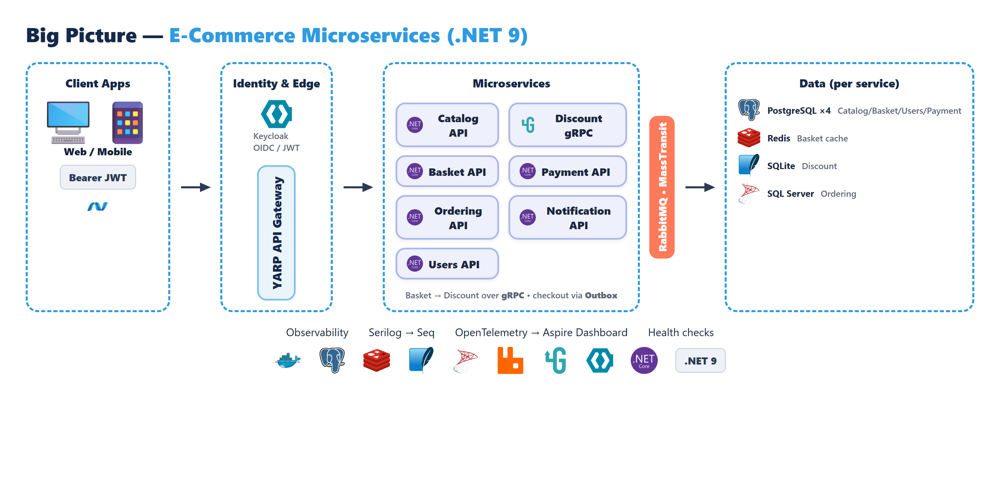

### Checkout Flow (Outbox + Saga)
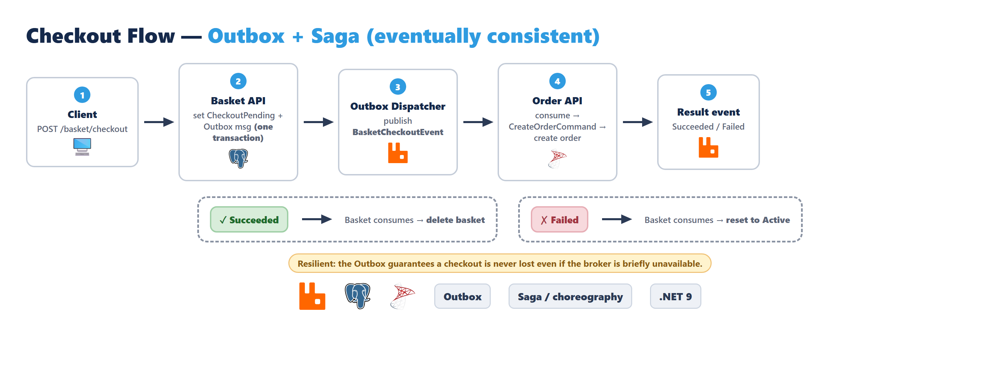

### Identity & Security (Keycloak / JWT)
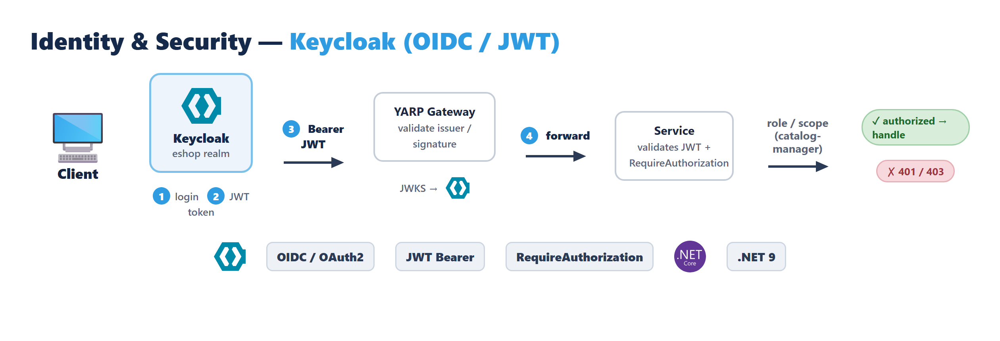

### API Gateway
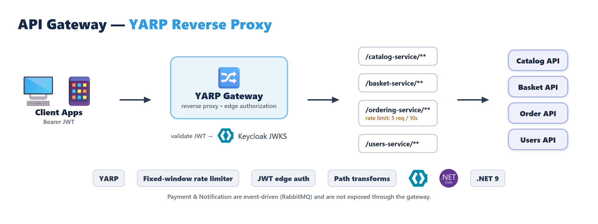

### Catalog Service
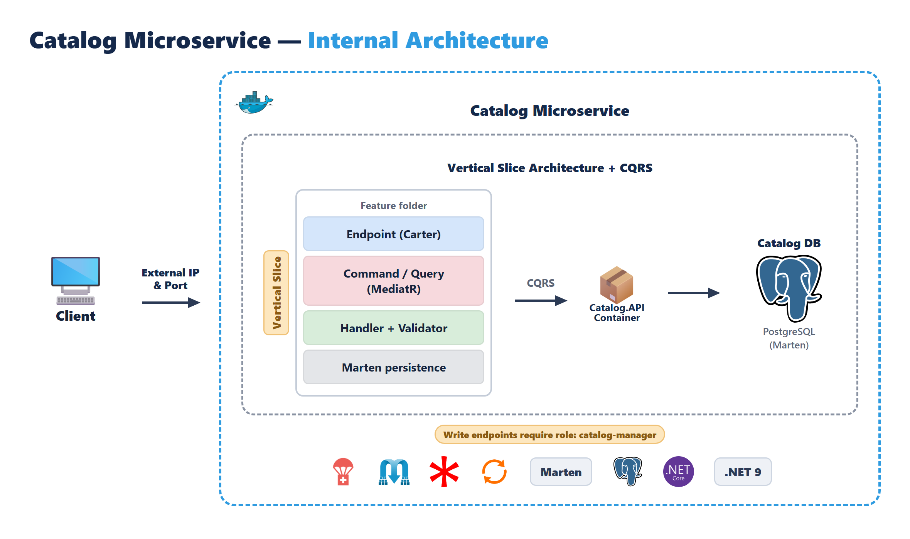

### Basket Service
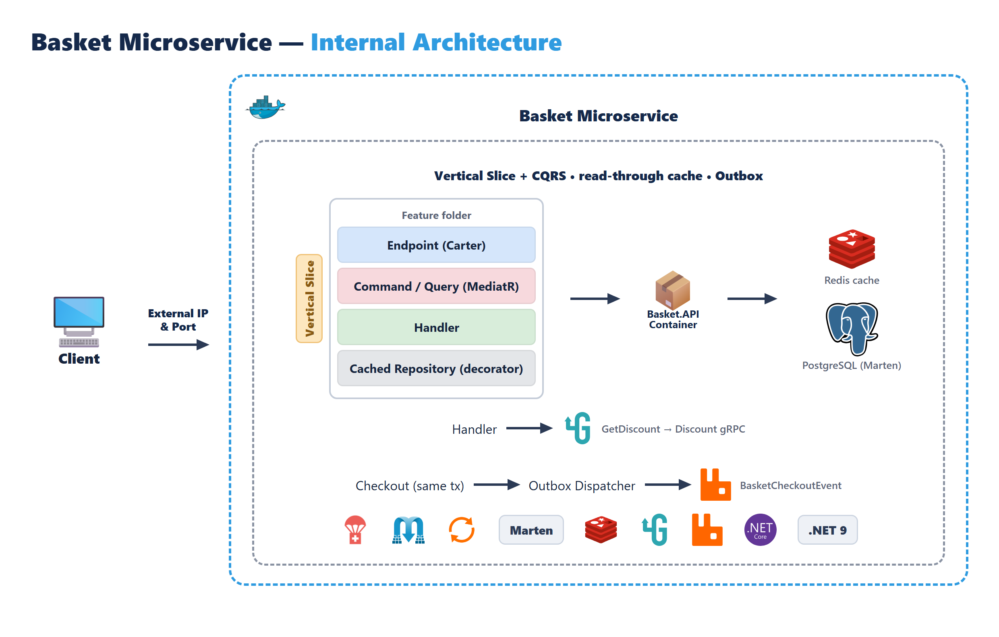

### Discount Service
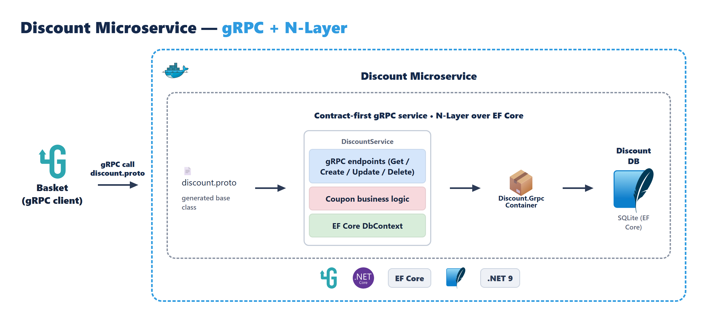

### Ordering Service
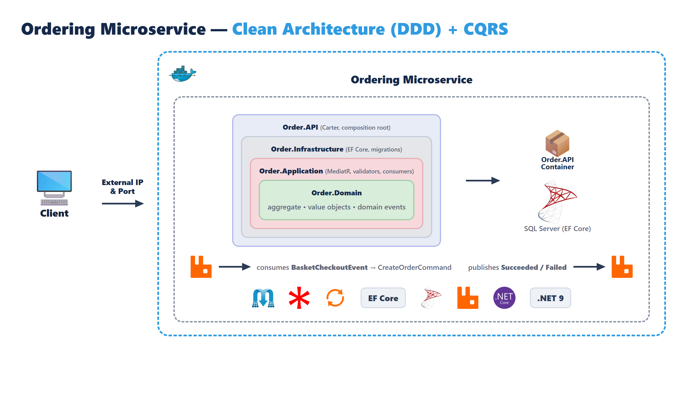

### Users Service
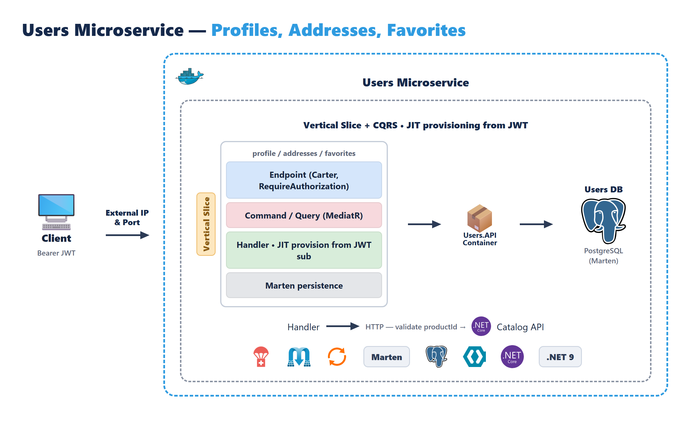

### Payment Service
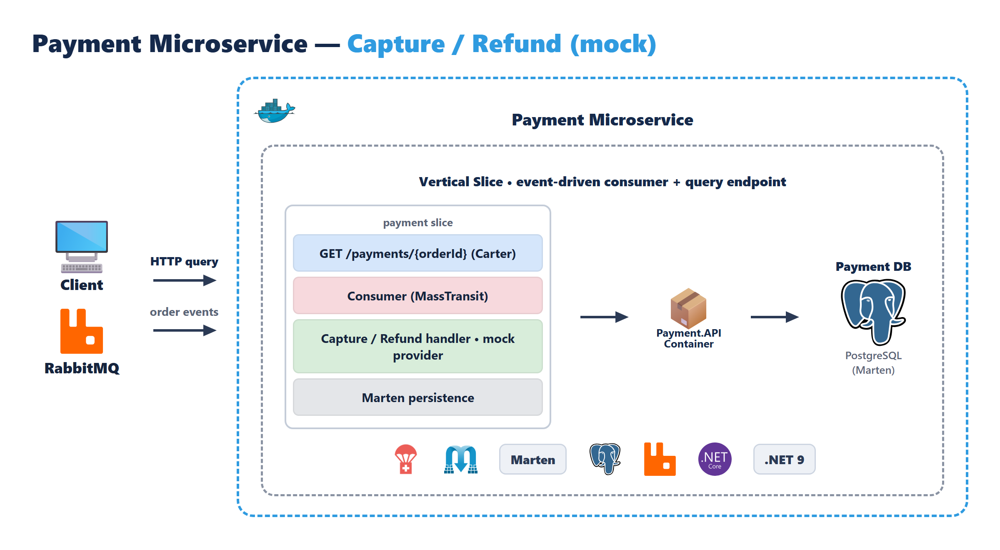

### Notification Service
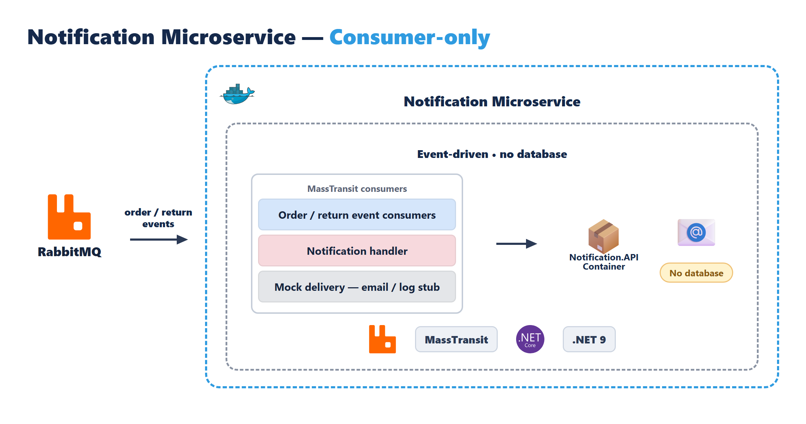

## Solution Structure

```text
Src
  ApiGateways
    YarpApiGateway
  BuildingBlocks
    BuildingBlock
    BuildingBlockMessaging
  Services
    CatalogAPI
    Basket/BasketAPI
    DiscountGrpc
    Order
      Order.API
      Order.Application
      Order.Domain
      Order.Infrastructure
    UsersAPI
    PaymentAPI
    NotificationAPI
Tests
  ECommerce_Tests
```

## Services Overview

| Service | Main Responsibility | Storage / Integration | Architectural Style | Docker HTTP Port |
|---|---|---|---|---|
| CatalogAPI | Product CRUD and browsing (writes guarded by `catalog-manager` role) | PostgreSQL (Marten) | Vertical slice | `6000` |
| BasketAPI | Basket CRUD, discount-aware pricing, checkout start (Outbox) | PostgreSQL (Marten), Redis, gRPC client, RabbitMQ | Vertical slice | `6001` |
| DiscountGrpc | Coupon management via gRPC | SQLite (EF Core) | gRPC service | `6002` |
| Order.API | Order CRUD, lifecycle, order-from-event | SQL Server (EF Core), RabbitMQ | Clean Architecture | `6003` |
| UsersAPI | Profile, addresses, favorites (JIT provisioning from JWT) | PostgreSQL (Marten) | Vertical slice | `6004` |
| PaymentAPI | Mock payment capture/refund (event-driven) | PostgreSQL (Marten), RabbitMQ | Vertical slice (consumer) | `6005` |
| NotificationAPI | Mock notifications on order/return events | none (no DB), RabbitMQ | Consumer-only | `6006` |
| YarpApiGateway | Reverse proxy + rate limiting + edge authorization | Proxies to services | (in docker-compose) | `5004` |

> **Infrastructure containers:** PostgreSQL ×4 (Catalog/Basket/Users/Payment), SQL Server (Order),
> Redis, RabbitMQ, **Keycloak** (identity), **Seq** (logs), **Aspire Dashboard** (traces/metrics).

## Core Technologies

- `.NET 9`
- `Minimal API` + `Carter`
- `MediatR` (commands/queries + pipeline behaviors)
- `FluentValidation`
- `Mapster`
- `Marten` for document persistence in Catalog/Basket/Users/Payment
- `Entity Framework Core` in Order (SQL Server) and Discount (SQLite)
- `MassTransit` + `RabbitMQ`
- `Redis` distributed cache
- `YARP` API Gateway (rate limiting + edge authorization)
- `Keycloak` — OIDC/JWT identity provider
- `Serilog` — structured logging, shipped to `Seq`
- `OpenTelemetry` — traces/metrics, exported to the `Aspire Dashboard`
- `Polly` — transient-fault retries (e.g. Catalog seeding)

## Identity & Security

Authentication and authorization are centralized in **Keycloak** (the `eshop` realm).

1. The client logs in to Keycloak and receives a JWT access token.
2. The token is sent as a `Bearer` header to the gateway.
3. The `YarpApiGateway` validates the token (issuer/signature via Keycloak JWKS) and applies its `default` authorization policy at the edge.
4. Each service also validates the JWT and protects endpoints with `RequireAuthorization`.
5. Role/scope checks apply where needed — for example Catalog management endpoints require the `catalog-manager` role; `UsersAPI` provisions a user record just-in-time from the token `sub`.

The Keycloak admin console / OIDC issuer is exposed on `http://localhost:8088`.

## Observability

- **Serilog** writes structured (JSON) logs that are shipped to **Seq** (`http://localhost:8081`).
- **OpenTelemetry** exports traces and metrics over OTLP to the **.NET Aspire Dashboard** (`http://localhost:18888`).
- Each service also exposes a `GET /health` endpoint (Catalog, Basket, Order).

## Checkout Flow (Outbox + Saga)

Checkout is eventually consistent and resilient to temporary broker/network failures.

1. Client calls `POST /basket/checkout` in Basket API.
2. Basket API validates basket state (`Active`, non-empty).
3. Basket is marked as `CheckoutPending` and a `BasketCheckoutOutboxMessage` is stored in Basket DB in the same transaction.
4. `BasketCheckoutOutboxDispatcher` background service reads pending outbox rows and publishes `BasketCheckoutEvent` to RabbitMQ.
5. Order service consumes the event, maps it to `CreateOrderCommand`, and creates the order.
6. Order service publishes `BasketCheckoutSucceededEvent` when order creation succeeds.
7. Order service publishes `BasketCheckoutFailedEvent` when processing fails.
8. Basket service consumes the result event and finalizes state (`success -> delete basket`, `failure -> set basket back to Active`).

This design avoids losing checkout requests even if broker publishing fails immediately after API request handling.

## API Gateway Routing

When running `YarpApiGateway`, use:

- `/catalog-service/{**catch-all}` -> Catalog API
- `/basket-service/{**catch-all}` -> Basket API
- `/ordering-service/{**catch-all}` -> Order API
- `/users-service/{**catch-all}` -> Users API

Routes use the `default` authorization policy (JWT required at the edge). The `ordering-service` route additionally has a fixed-window rate limiter (`5 requests / 10 seconds`).

> Payment and Notification are event-driven (RabbitMQ) and are not exposed through the gateway.

## Key Endpoints

### Catalog API (`http://localhost:6000`)
- `GET /products`
- `GET /products/{id}`
- `GET /products/category/{category}`
- `POST /product-create` *(requires `catalog-manager` role)*
- `PUT /product-update` *(requires `catalog-manager` role)*
- `DELETE /product-delete/{id}` *(requires `catalog-manager` role)*

### Basket API (`http://localhost:6001`)
- `GET /basket/{userName}`
- `POST /basket-store`
- `POST /basket/checkout`
- `DELETE /basket/{userName}`

### Order API (`http://localhost:6003`)
- `GET /orders`
- `GET /orders/by-name/{orderName}`
- `GET /orders/by-customer/{customerId}`
- `POST /orders`
- `PUT /orders`
- `DELETE /orders/{id}`

### Users API (`http://localhost:6004`) *(all require a valid JWT)*
- `GET /users/me/profile`
- `PUT /users/me/profile`
- `GET /users/me/addresses`
- `POST /users/me/addresses`
- `GET /users/me/favorites`
- `POST /users/me/favorites`
- `DELETE /users/me/favorites/{productId}`

### Payment API (`http://localhost:6005`)
- `GET /payments/{orderId}`
- (capture/refund are driven by order events over RabbitMQ)

### Health Checks
- Catalog: `GET /health`
- Basket: `GET /health`
- Order: `GET /health`

## Running The Project

### Prerequisites
- `.NET SDK 9.0`
- `Docker Desktop`
- `Visual Studio 2022/2026` or `VS Code`

### Run With Docker Compose

From repository root:

```bash
docker compose up -d --build
```

This starts:
- PostgreSQL (`catalogdb`, `basketdb`, `usersdb`, `paymentdb`)
- SQL Server (`orderdb`)
- Redis (`distributedcache`)
- RabbitMQ (`messagebroker`, management UI on `15672`)
- Keycloak (`keycloak`, console on `8088`)
- Seq (`seq`, UI on `8081`)
- Aspire Dashboard (`otel-dashboard`, UI on `18888`)
- Catalog, Basket, Discount gRPC, Order, Users, Payment, Notification services
- YarpApiGateway (`5004`)

RabbitMQ default credentials are `guest` / `guest` (unless overridden via environment).

### Supporting UIs

| Tool | URL | Purpose |
|---|---|---|
| RabbitMQ | `http://localhost:15672` | Message broker management |
| Keycloak | `http://localhost:8088` | Identity / realm admin |
| Seq | `http://localhost:8081` | Structured logs |
| Aspire Dashboard | `http://localhost:18888` | Traces & metrics |

### Run Services From Visual Studio / CLI

If you want to debug services individually:

1. Start infrastructure containers first (db/cache/broker/keycloak).
2. Run service projects from the solution startup profile or `dotnet run`.

Default local HTTP ports from launch profiles:

- CatalogAPI: `5000`
- BasketAPI: `5001`
- DiscountGrpc: `5002`
- Order.API: `5003`
- YarpApiGateway: `5004`

## Quick Test Scenario

1. Obtain a JWT from Keycloak (`eshop` realm) and send it as a `Bearer` token.
2. Fetch products from Catalog: `GET /products`
3. Create or update a basket in Basket API: `POST /basket-store`
4. Trigger checkout: `POST /basket/checkout`
5. Verify order creation in Order API: `GET /orders/by-customer/{customerId}`

Note: checkout creates orders asynchronously through messaging.
`POST /orders` is also available for direct order creation.

## Running Tests

```bash
dotnet test
```

## License

This project is licensed under the terms defined in `LICENSE.txt`.
