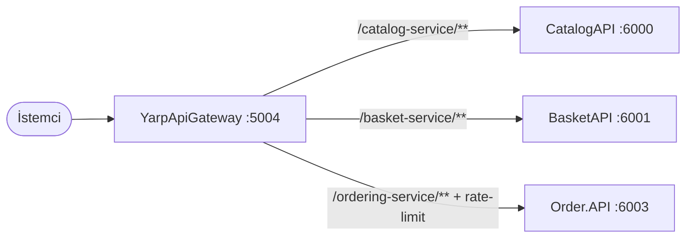

# 08 — Gateway & Dağıtım

## YarpApiGateway

Reverse proxy + rate limiting. Servislere `appsettings.json`'daki YARP route/cluster
yapılandırmasıyla yönlendirir. **docker-compose içinde değildir**; gerektiğinde ayrı çalıştırılır.
Local port: `5004`.

### Program.cs

```csharp
builder.Services.AddReverseProxy()
    .LoadFromConfig(builder.Configuration.GetSection("ReverseProxy"));

// Gerçek istemci IP'sini X-Forwarded-For'dan çöz — yalnız GÜVENİLEN proxy'lerden.
builder.Services.Configure<ForwardedHeadersOptions>(o =>
{
    o.ForwardedHeaders = ForwardedHeaders.XForwardedFor | ForwardedHeaders.XForwardedProto;
    // ForwardedHeaders:KnownProxies (virgülle ayrık IP) tanımlıysa eklenir; tanımlı değilse
    // güvenli varsayılan (loopback) geçerli → istemci X-Forwarded-For SPOOF'layıp partition atlayamaz.
});

// FIX-030: istemci-başı (kullanıcı veya IP) PARTITION'lı rate limit — ortak kova değil.
builder.Services.AddRateLimiter(opts =>
{
    opts.RejectionStatusCode = StatusCodes.Status429TooManyRequests;
    opts.OnRejected = async (ctx, ct) => { ctx.HttpContext.Response.Headers.RetryAfter = "10"; /* ... */ };
    // Kimlik servislerle AYNI claim'den okunur (GetUserId -> NameIdentifier); "sub" doğrudan null gelir.
    static string Key(HttpContext h) { var u = h.User.GetUserId(); return !string.IsNullOrEmpty(u) ? $"u:{u}" : $"ip:{h.Connection.RemoteIpAddress}"; }
    opts.AddPolicy("fixed",          h => RateLimitPartition.GetFixedWindowLimiter(Key(h), _ => new() { Window = TimeSpan.FromSeconds(10), PermitLimit = 5 }));
    opts.AddPolicy("auth-sensitive", h => RateLimitPartition.GetFixedWindowLimiter(Key(h), _ => new() { Window = TimeSpan.FromSeconds(10), PermitLimit = 20 }));
    opts.AddPolicy("catalog-loose",  h => RateLimitPartition.GetFixedWindowLimiter(Key(h), _ => new() { Window = TimeSpan.FromSeconds(10), PermitLimit = 100 }));
});

var app = builder.Build();
app.UseForwardedHeaders();
app.UseAuthentication(); app.UseAuthorization();
app.UseRateLimiter();
app.MapReverseProxy();
app.Run();
```

### Route → Cluster Eşlemesi (appsettings.json)

| Route | Gelen path | Hedef (cluster) | Authz | Rate limit |
|---|---|---|---|---|
| `catalog-route` | `/catalog-service/{**catch-all}` | `http://localhost:6000/` | — (public) | `catalog-loose` (10sn/100) |
| `basket-route` | `/basket-service/{**catch-all}` | `http://localhost:6001/` | `default` | `auth-sensitive` (10sn/20) |
| `ordering-route` | `/ordering-service/{**catch-all}` | `http://localhost:6003/` | `default` | `fixed` (10sn/5) |
| `users-route` | `/users-service/{**catch-all}` | `http://localhost:6004/` | `default` | `auth-sensitive` (10sn/20) |

> Rate limit istemci-başı partition'lıdır (token `sub`, yoksa IP). Detaylı güvenlik modeli:
> [10 — Güvenlik & Auth](10-security-and-auth.md).

Her route bir `PathPattern: {**catch-all}` transform'u ile prefix'i sıyırır (örn.
`/catalog-service/products` → servise `/products` olarak gider).



> **Yaygın hata:** Gateway arkasına yeni endpoint eklerken YARP route eklenmezse, endpoint
> servise doğrudan çalışır ama gateway üzerinden 404 döner.

> **Not:** Discount (gRPC) gateway üzerinden yayınlanmaz; yalnızca Basket tarafından servis-içi
> gRPC ile çağrılır.

---

## docker-compose

`docker-compose.yml` (servis/imaj tanımları) + `docker-compose.override.yml` (env, port, volume).
Gateway dahil değildir.

### Konteynerler

| Konteyner | İmaj | Yayınlanan portlar | Açıklama |
|---|---|---|---|
| `catalogdb` | `postgres:17-alpine` | `5432:5432` | CatalogDb (volume: postgres_catalog) |
| `basketdb` | `postgres:17-alpine` | `5433:5432` | BasketDb (volume: postgres_basket) |
| `orderdb` | `mcr.microsoft.com/mssql/server` | `1433:1433` | OrderDb (SA_PASSWORD=MyDb1234!) |
| `distributedcache` | `redis` | `6379:6379` | Basket cache |
| `messagebroker` | `rabbitmq:management` | `5672:5672`, `15672:15672` | hostname `ecommerce-mq` |
| `catalogapi` | build: CatalogAPI/Dockerfile | `6000:8080`, `6060:8081` | |
| `basketapi` | build: BasketAPI/Dockerfile | `6001:8080`, `6061:8081` | |
| `discountgrpc` | build: DiscountGrpc/Dockerfile | `6002:8080`, `6062:8081` | |
| `order.api` | build: Order.API/Dockerfile | `6003:8080`, `6063:8081` | |

### Konteyner içi bağlantı (override env)

- **basketapi:** `PostgreDataBase=Server=basketdb;...`, `Redis=distributedcache:6379`,
  `GrpcSettings__DiscountUrl=https://discountgrpc:8081`, `MessageBroker__Host=amqp://ecommerce-mq:5672`.
- **order.api:** `Database=Server=orderdb;...`, `MessageBroker__Host=amqp://ecommerce-mq:5672`,
  `FeatureManagement__OrderFullfilment=false`.
- **catalogapi:** `PostgreDataBase=Server=catalogdb;...`.

`depends_on` ile sıralama: basketapi → (basketdb, distributedcache, discountgrpc, messagebroker);
order.api → (orderdb, messagebroker); catalogapi → catalogdb.

### Port Haritası Özeti

| Servis | Docker (HTTP/HTTPS) | Local launch profile |
|---|---|---|
| CatalogAPI | 6000 / 6060 | 5000 |
| BasketAPI | 6001 / 6061 | 5001 |
| DiscountGrpc | 6002 / 6062 | 5002 |
| Order.API | 6003 / 6063 | 5003 |
| YarpApiGateway | (compose'da yok) | 5004 |

---

## Build & Çalıştırma

```bash
docker compose up -d --build      # tüm altyapı + servisler (gateway hariç)
dotnet build                      # çözümü derle
dotnet test                       # test projesini çalıştır
dotnet run --project Src/...      # tek servisi CLI'dan çalıştır
```

- RabbitMQ yönetim arayüzü: `http://localhost:15672` (guest/guest).
- Gateway'i ayrı çalıştırın: `dotnet run --project Src/ApiGateways/YarpApiGateway`.

## Health Checks

`GET /health` — Catalog (PostgreSQL), Basket (PostgreSQL + Redis), Order (SQL Server).
HealthChecks UI formatında JSON döner.

Devamı: [09 — Test Stratejisi](09-testing.md)
